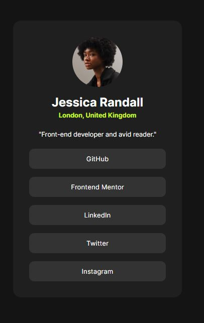

# Frontend Mentor - Social links profile solution

This is a solution to the [Social links profile challenge on Frontend Mentor](https://www.frontendmentor.io/challenges/social-links-profile-UG32l9m6dQ). Frontend Mentor challenges help you improve your coding skills by building realistic projects. 

## Table of contents

- [Overview](#overview)
  - [The challenge](#the-challenge)
  - [Screenshot](#screenshot)
  - [Links](#links)
- [My process](#my-process)
  - [Built with](#built-with)
  - [What I learned](#what-i-learned)
  - [Continued development](#continued-development)

## Overview

### The challenge

Users should be able to:

- See hover and focus states for all interactive elements on the page

### Screenshot

### Links

- Solution: [Github](https://github.com/UnknownBuilder/FEmentor_Social-Links-Profile)
- Live Site: [Social Links Profile Challenge](https://unknownbuilder.github.io/FEmentor_Social-Links-Profile/)

## My process

### Built with

Nothing fancy here. It's all vanilla.

- HTML
- CSS 

### What I learned

This challenge was the first challenge I didn't need to look anything up. I just knew all of the code that I needed and went into a state of flow. 

This challenge served to solidify what I have already learned. 

### Continued development

Although this challenge was simple and a part of me wants to move on to the junior level stuff, my completionist tendancies cannot be ignored. I'm going to shoot to finish all the newbie challenges. It will be good to solidify the newbie stuff into my brain. After all, programming is a perashible skill; anything I can commit to long term memory is a win. 